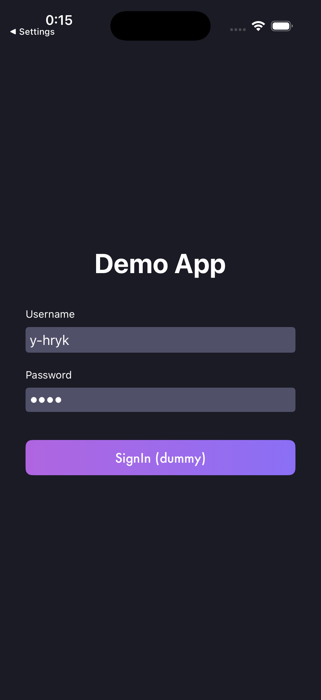
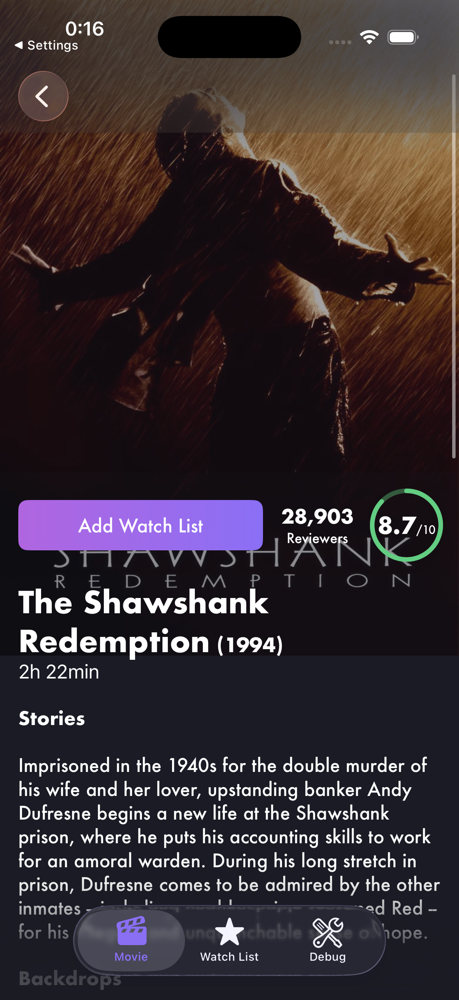

# Swift-Redux-Demo
A Redux-like architecture with multiple stores.  
Uses the [TMDB](https://www.themoviedb.org/) web API.

<table cellspacing="0" cellpadding="0" style="border: none;">
    <tr>
        <td></td>
        <td></td>
        <td></td>
    </tr>
</table>

## Environment
- Swift 6
- Xcode 26

## Get Started
1. [TMDB](https://www.themoviedb.org/)に登録してAPIトークンを取得する
2. Config-Template.plistをコピー
3. Config-Template.plistをConfig.plistにリネーム
4. Config.plistにAPIKeyを入力

## Flow

```mermaid
---
config:
  theme: neutral
  flowchart:
    curve: basis
---
graph TD
    %% External Components
    View[📱 View]
    ActionCreator[⚡ Action Creator]
    
    %% Actions
    Action[🎯 Action]
    ThunkAction[🔄 Thunk Action]
    
    %% Local Store
    subgraph lstore [🏪 Local Store]
        lstore_desc["<i>1 Screen  1 Store</i>"]
        direction TB
        m1[🔧 Middleware] 
        r1[⚙️ Reducer]
        s1[📦 Local State]
        
        m1 --> r1
        r1 --> s1
    end
    
    %% Global Store  
    subgraph gstore [🌍 Global Store]
        direction TB
        r2[⚙️ Reducer] 
        s2[📦 Global State]
        
        r2 --> s2
    end
    
    %% Flow connections
    View --> Action
    View --> ActionCreator
    ActionCreator --> ThunkAction
    
    Action --> m1
    ThunkAction --> m1
    
    s1 --> View
    s2 --> View
    
    %% Store communication
    m1 --> gstore
    
    %% Styling
    classDef viewClass fill:#e3f2fd,stroke:#1976d2,stroke-width:3px
    classDef actionClass fill:#fff3e0,stroke:#f57c00,stroke-width:2px
    classDef storeClass fill:#f1f8e9,stroke:#388e3c,stroke-width:2px
    classDef componentClass fill:#fce4ec,stroke:#c2185b,stroke-width:2px
    
    class View viewClass
    class Action,ThunkAction,ActionCreator actionClass
    class m1,r1,s1,r2,s2 storeClass
```

## Application Features
- Splash
- Sign in
- Sign out
- Movie List
- Movie Detail
- Filmography
- Watch List
- Maintenance Screen
- Deep Link