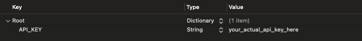
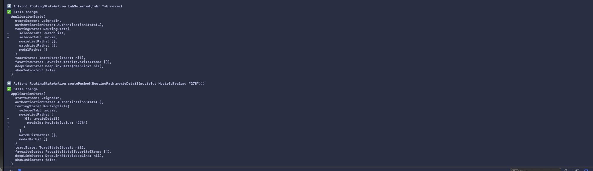

# Swift-Redux-Demo
A Redux-like architecture with multiple stores.  
Uses the [TMDB](https://www.themoviedb.org/) web API.


## Environment
- Swift 6
- Xcode 26

## Setup
1. Register with [TMDB](https://www.themoviedb.org/) and obtain an API token
2. Copy `Config-Template.plist`
3. Rename `Config-Template.plist` to `Config.plist`
4. Enter the API Key in `Config.plist`


## Redux Flow

```mermaid
---
config:
  theme: neutral
  flowchart:
    curve: basis
---
graph TD
    %% External Components
    View[📱 View]
    ActionCreator[⚡ Action Creator]
    
    %% Actions
    Action[🎯 Action]
    ThunkAction[🔄 Thunk Action]
    
    %% Local Store
    subgraph lstore [🏪 Local Store]
        lstore_desc["<i>1 Screen  1 Store</i>"]
        direction TB
        m1[🔧 Middleware] 
        r1[⚙️ Reducer]
        s1[📦 Local State]
        
        m1 --> r1
        r1 --> s1
    end
    
    %% Global Store  
    subgraph gstore [🌍 Global Store]
        direction TB
        r2[⚙️ Reducer] 
        s2[📦 Global State]
        
        r2 --> s2
    end
    
    %% Flow connections
    View --> Action
    View --> ActionCreator
    ActionCreator --> ThunkAction
    
    Action --> m1
    ThunkAction --> m1
    
    s1 --> View
    s2 --> View
    
    %% Store communication
    m1 --> gstore
    
    %% Styling
    classDef viewClass fill:#e3f2fd,stroke:#1976d2,stroke-width:3px
    classDef actionClass fill:#fff3e0,stroke:#f57c00,stroke-width:2px
    classDef storeClass fill:#f1f8e9,stroke:#388e3c,stroke-width:2px
    classDef componentClass fill:#fce4ec,stroke:#c2185b,stroke-width:2px
    
    class View viewClass
    class Action,ThunkAction,ActionCreator actionClass
    class m1,r1,s1,r2,s2 storeClass
```



## Application Features
- Splash
- Sign in
- Sign out
- Movie List
- Movie Detail
- Filmography
- Watch List
- Maintenance Screen
- Deep Link

## Debugging Function
### State changelog
You can keep track of state changes.
```swift
let store = LocalStoreBuilder
    .default(initialState: MoviePageState())
    .enableTrace()
    .build()

let view = MovieListScreen(store: store)
```

#### Log sample



### Delaying network communication processing
Delays network communication by suspending it for one second during communication. This makes it easier to implement loading etc.
```swift
LocalStoreBuilder
    .default(initialState: MoviePageState())
    .enableDelayRequest()
    .build()
```
